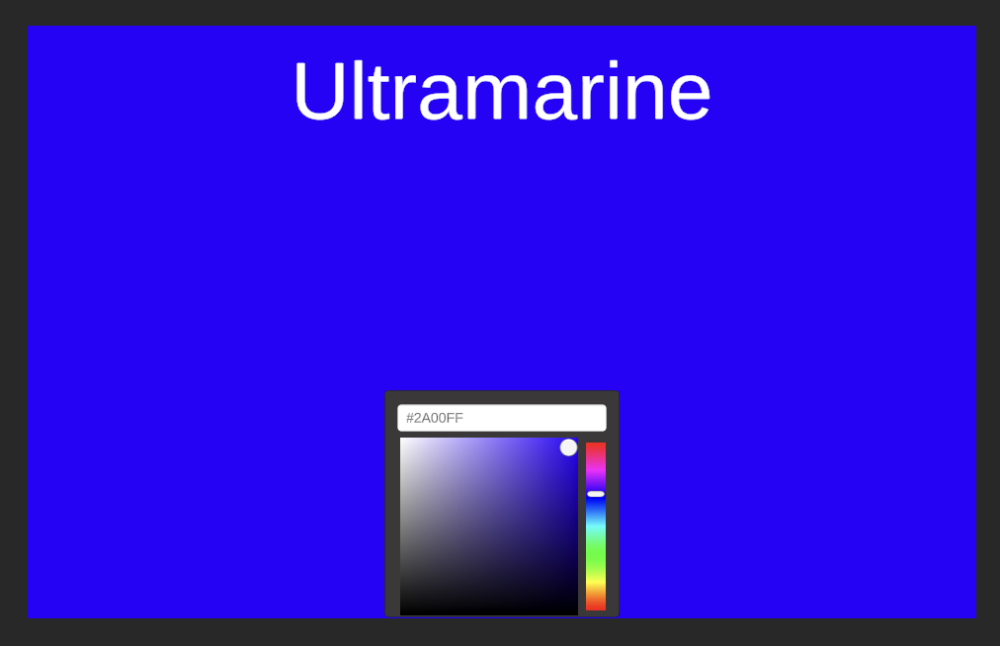

# ColorNames
Get the name of a given color

https://williamrjackson.github.io/ColorNames/index.html

Finds the closest color listed on wikipedia (as of 02/20/24) and reports the name.

https://en.wikipedia.org/wiki/List_of_colors_(alphabetical)#List_of_colors

    

Demo uses https://github.com/judah4/HSV-Color-Picker-Unity/